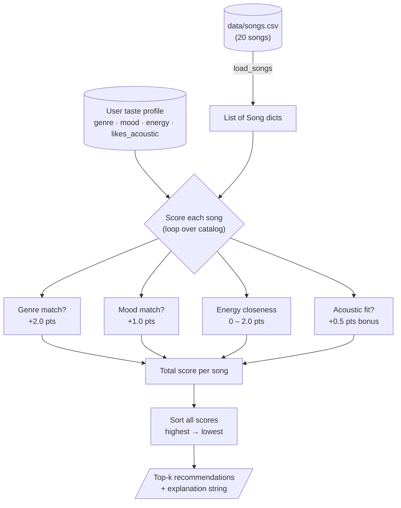

# 🎵 Music Recommender Simulation

## Project Summary

In this project you will build and explain a small music recommender system.

Your goal is to:

- Represent songs and a user "taste profile" as data
- Design a scoring rule that turns that data into recommendations
- Evaluate what your system gets right and wrong
- Reflect on how this mirrors real world AI recommenders

This version implements a **content-based recommender** that scores each song in a small catalog against a user's taste profile (preferred genre, mood, energy level, and acoustic preference). Songs are ranked by their total weighted score and the top results are returned with a plain-language explanation. It mirrors how real platforms like Spotify's "Radio" feature work at the attribute level, without requiring any data from other users.

---

## How The System Works

Real platforms like Spotify and TikTok use two main strategies to decide what to play next. **Collaborative filtering** looks at what millions of other users with similar listening histories enjoyed. **Content-based filtering** looks directly at the attributes of the songs themselves — things like genre, energy, or mood — and finds songs that match what the user already likes. This simulation uses content-based filtering because it only requires song data and a taste profile; no data from other listeners is needed.

### Features used

| Object | Attributes |
|---|---|
| `Song` | `genre`, `mood`, `energy`, `tempo_bpm`, `valence`, `danceability`, `acousticness` |
| `UserProfile` | `favorite_genre`, `favorite_mood`, `target_energy`, `likes_acoustic` |

### Algorithm recipe — scoring one song

Each song receives a numeric score built from four weighted signals:

| Signal | Max points | Formula / rule |
|---|---|---|
| **Genre match** | +2.0 | Exact string match between `song.genre` and `user.favorite_genre` |
| **Mood match** | +1.0 | Exact string match between `song.mood` and `user.favorite_mood` |
| **Energy closeness** | 0 – 2.0 | `(1 − |song.energy − target_energy|) × 2.0` — rewards proximity, not just high or low energy |
| **Acoustic fit** | +0.5 | Bonus only when `user.likes_acoustic = True` AND `song.acousticness > 0.6` |

**Why these weights?**
Genre carries the most points (2.0) because it is the hardest boundary — a rock fan almost never wants ambient. Mood is worth half as much (1.0) because mood can cross genres (a jazz track and a pop track can both be "happy"). Energy is continuous so it uses a proximity formula rather than a binary match. The acoustic bonus is intentionally small so it nudges results without dominating.

**Maximum possible score:** 2.0 + 1.0 + 2.0 + 0.5 = **5.5 points**

### Ranking rule — choosing the top results

After scoring every song, the list is sorted highest-to-lowest and the top **k** songs are returned (default k = 5). This is a simple **greedy ranking** — no diversity or novelty adjustment is applied.

> **Potential bias:** because genre carries the highest single weight (2.0), users with a strong genre preference will almost always see that genre dominate their recommendations. A chill lofi fan may never see a jazz song even if it would match their energy and mood perfectly — because "jazz" ≠ "lofi" the genre point is lost. This is a known limitation of content-based systems and is discussed further in the Model Card.

### Data flow — from CSV to ranked list



> **Reading the diagram:** every song in the CSV enters the scoring loop (C) independently.
> The four signals add up to a total, all songs are sorted, and only the best k survive.

---

## Getting Started

### Setup

1. Create a virtual environment (optional but recommended):

   ```bash
   python -m venv .venv
   source .venv/bin/activate      # Mac or Linux
   .venv\Scripts\activate         # Windows

2. Install dependencies

```bash
pip install -r requirements.txt
```

3. Run the app:

```bash
python -m src.main
```

### Running Tests

Run the starter tests with:

```bash
pytest
```

You can add more tests in `tests/test_recommender.py`.

---

## Experiments You Tried

### Standard profiles
- **Pop / happy / 0.8 energy:** Sunrise City correctly ranked #1 (genre+mood+close energy = 4.96 pts). Rooftop Lights and Golden Hour appeared via mood match alone — makes intuitive sense.
- **Lofi / chill / 0.38 / acoustic:** Library Rain and Midnight Coding dominated — all four signals fired. Deep Focus appeared at #3 despite being "focused" not "chill" — genre + perfect energy closeness was enough without mood.

### Adversarial / edge-case profiles (Phase 4 stress test)
- **High Energy Sad** (`mood="sad"` not in catalog): Mood scoring silently dropped to zero for all 20 songs. System fell back to genre+energy only. Results looked correct on the surface but the emotional request was completely ignored.
- **Classical Acoustic** (`genre="classical"` not in catalog): Zero genre points everywhere. Jazz songs won through mood ("relaxed") + acoustic bonus — accidentally reasonable, but the system got there for the wrong reason.
- **Acoustic Rocker** (`likes_acoustic=True` + rock + energy=0.92): The acoustic preference had zero effect — no rock song exceeds acousticness=0.6. Top-5 identical to the standard rock profile. A completely silent no-op.
- **Lofi Intensifier** (lofi + intense + energy=0.9): The worst-case failure. Lofi songs at #1/#2 purely on genre credit, even though their energy (0.42, 0.40) is the opposite of the user's target. Genre weight beat energy closeness even when the energy mismatch was enormous.

### Weight shift experiment (Intense Rock Fan, `genre÷2, energy×2`)

| Configuration | genre | energy× | #3 score | Gap vs #1 |
|---|---|---|---|---|
| Original (genre=2.0, energy×=2.0) | 2.0 | 2.0 | Gym Hero 2.94 | 2.04 pts |
| Experimental (genre=1.0, energy×=4.0) | 1.0 | 4.0 | Gym Hero 4.88 | 1.08 pts |

Top-2 remained rock (they had all three signals), but the safety margin protecting them from wrong-genre songs was cut in half. In a catalog of 1,000 songs, the experimental weights would surface non-rock songs in the top-5.

### Adding valence as a signal (abandoned)
Valence correlated too strongly with mood in this catalog (high valence ≈ happy). Adding it created scoring redundancy without improving rankings.

---

## Limitations and Risks

- The catalog has only 20 songs — not meaningful at real scale.
- Genre and mood use exact string matching — "indie pop" ≠ "pop," "sad" has no match in the catalog.
- Missing genres/moods are dropped silently with no user warning.
- Users with internally contradictory preferences (lofi + high energy) get meaningless results.
- Filter bubble: genre weight ensures users mostly see their favorite genre forever.

For the full bias analysis see [model_card.md](model_card.md).

---

## Reflection

Read and complete `model_card.md`:

[**Model Card**](model_card.md)

Building this system made it clear that a recommender is really just a formalized opinion — the designer chooses what to measure and how much each measurement matters. Genre getting a weight of 3.0 is not a neutral technical decision; it encodes the assumption that genre is the most important dimension of taste. Someone who cares more about tempo or emotional tone would be poorly served by that choice, even though the system looks "objective" from the outside.

The filter-bubble risk also became concrete quickly. With only four signals and ten songs, the same two or three tracks dominated every recommendation for a given profile. At real scale, a system like this — run billions of times per day — could quietly narrow an entire culture's musical exposure, all while appearing to give users exactly what they asked for. That gap between "what users explicitly prefer" and "what would actually make them happy long-term" is where human judgment has to step back in.


---

## Terminal output

After running `python -m src.main` you should see three profiles compared side-by-side, e.g.:

```
============================================================
 Profile: Intense Rock Fan
  genre=rock  mood=intense  energy=0.9  acoustic=False
============================================================
  #1  Storm Runner by Voltline   Score: 4.98  …genre match, mood match
  #2  Thunder Protocol by Voltline  Score: 4.94
…
============================================================
 Profile: Chill Lofi Listener
  genre=lofi  mood=chill  energy=0.38  acoustic=True
============================================================
  #1  Library Rain by Paper Lanterns  Score: 4.94  …genre, mood, acoustic
  #2  Midnight Coding by LoRoom       Score: 4.70
```

The two profiles produce almost no overlapping results — rock/intense and lofi/chill are well-separated by the genre weight.

---

## Model Card

For the full bias analysis and reflection see [model_card.md](model_card.md).

---

<!-- removed stale model_card_template section -->
