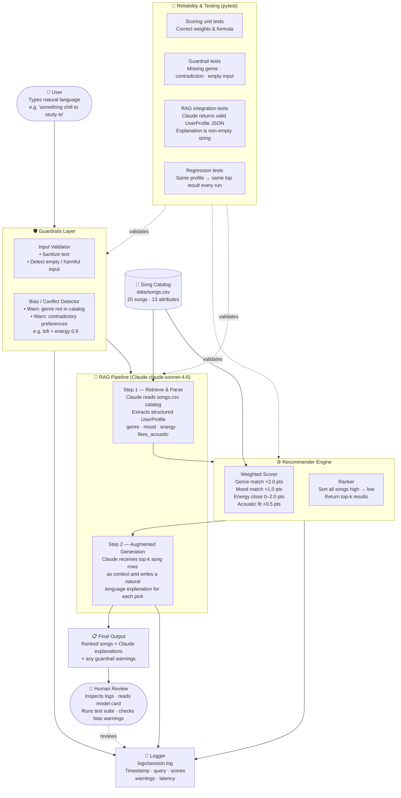

# System Architecture Diagram

Paste the code block below into https://mermaid.live to render and export as PNG.
Save the exported PNG as `assets/architecture.png`.

```mermaid
flowchart TD
    U(["👤 User\nTypes natural language\ne.g. 'something chill to study to'"])

    subgraph GUARD ["🛡️ Guardrails Layer"]
        GV["Input Validator\n• Sanitize text\n• Detect empty / harmful input"]
        GW["Bias / Conflict Detector\n• Warn: genre not in catalog\n• Warn: contradictory preferences\n  e.g. lofi + energy 0.9"]
    end

    subgraph RAG ["🤖 RAG Pipeline  (Claude claude-sonnet-4-6)"]
        R1["Step 1 — Retrieve & Parse\nClaude reads songs.csv catalog\nExtracts structured UserProfile\ngenre · mood · energy · likes_acoustic"]
        R2["Step 2 — Augmented Generation\nClaude receives top-k song rows\nas context and writes a natural\nlanguage explanation for each pick"]
    end

    subgraph CORE ["⚙️ Recommender Engine"]
        SC["Weighted Scorer\nGenre match   +2.0 pts\nMood match    +1.0 pts\nEnergy close  0–2.0 pts\nAcoustic fit  +0.5 pts"]
        RK["Ranker\nSort all songs high → low\nReturn top-k results"]
    end

    DB[("📀 Song Catalog\ndata/songs.csv\n20 songs · 13 attributes")]

    LOG["📝 Logger\nlogs/session.log\nTimestamp · query · scores\nwarnings · latency"]

    OUT["📋 Final Output\nRanked songs + Claude explanations\n+ any guardrail warnings"]

    subgraph TEST ["🧪 Reliability & Testing  (pytest)"]
        T1["Scoring unit tests\nCorrect weights & formula"]
        T2["Guardrail tests\nMissing genre · contradiction · empty input"]
        T3["RAG integration tests\nClaude returns valid UserProfile JSON\nExplanation is non-empty string"]
        T4["Regression tests\nSame profile → same top result every run"]
    end

    HUM(["👤 Human Review\nInspects logs · reads model card\nRuns test suite · checks bias warnings"])

    U --> GUARD
    GUARD --> LOG
    GUARD --> RAG
    DB --> R1
    R1 --> CORE
    DB --> SC
    CORE --> R2
    R2 --> OUT
    CORE --> LOG
    R2 --> LOG
    OUT --> HUM
    TEST -.->|validates| GUARD
    TEST -.->|validates| CORE
    TEST -.->|validates| RAG
    HUM -.->|reviews| LOG
```
